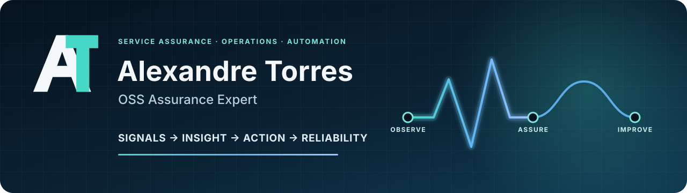

> **I turn complex operational signals into reliable services.**
>
> OSS Assurance · Operational Automation · IT Operations

I work at the intersection of service-critical telecommunications operations and IT
service assurance. My background spans network monitoring, second-line incident
analysis, troubleshooting, process improvement, operational automation and project
delivery across international environments.

## Focus areas

- OSS and service assurance
- Incident, event and alarm analysis
- Operational automation with Python, SQL and Bash
- Monitoring, troubleshooting and service continuity
- Linux, operational data analysis and internal tooling
- Runbooks, technical documentation and cross-functional delivery

## Selected public work

- [Proxmox Service Notes](https://github.com/alexandretorres17/proxmox-service-notes) — Bash
  tooling for generating useful operational notes for Proxmox VMs and containers.
  Includes reproducible examples, dry-run safety, 18 automated tests, ShellCheck
  and a successful continuous-integration workflow.
- [Concurrent and Distributed Game — Academic Archive](https://github.com/alexandretorres17/concurrent-distributed-game-academic-archive)
  — reviewed two-person ISCTE group project demonstrating concurrency, coordinated
  state management and TCP client/server communication in Java.
- [Genetic Algorithm for Nurse Scheduling — Academic Archive](https://github.com/alexandretorres17/genetic-algorithm-nurse-scheduling-academic-archive)
  — reviewed five-person ISCTE group project demonstrating reproducible Python,
  constrained optimisation, automated tests and CI.

Academic repositories are preserved as read-only group archives with explicit
attribution and publication boundaries.

## Working principles

- Build tools around real operational problems and clear failure modes.
- Prefer reproducible demonstrations, automated checks and useful documentation.
- Keep professional operational details at a high level to respect confidentiality.
- Use synthetic or non-sensitive data in public technical work.

## Connect

[LinkedIn](https://www.linkedin.com/in/alexandre-torres-0b90a140/)
